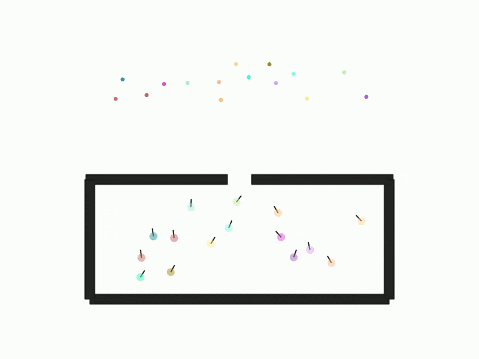
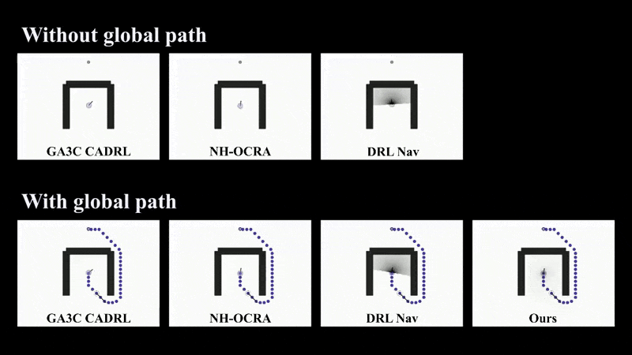
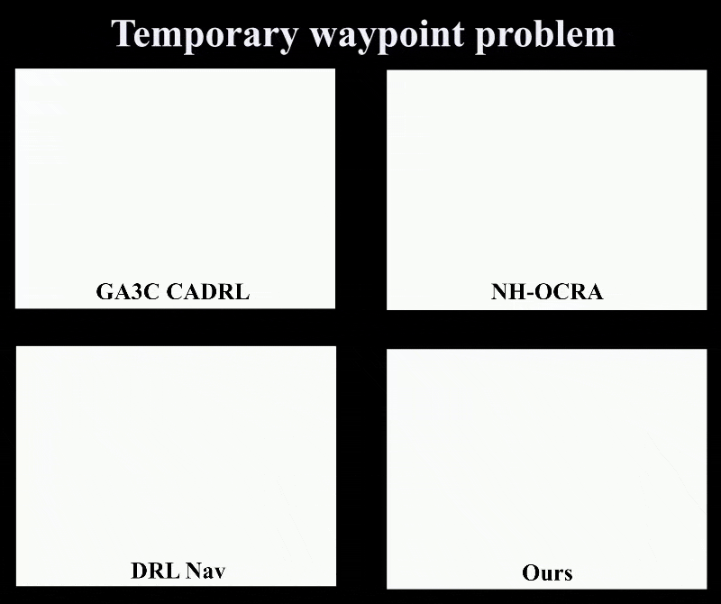

# Cooperative Multi-Agent Collision Avoidance with Attentive Graph Networks and Global Path Integration
## 🚨 **Paper Under Review** 🚨
### **Everything will be visible when accepted.**
This repository contains the official implementation of the paper **"Cooperative multi-agent collision avoidance with attentive graph networks and global path integration"**. This work introduces a novel approach to multi-robot collision avoidance, integrating global path planning with local navigation strategies, utilizing attentive graph neural networks.

|  |  |
|:---------------------------------------------------------:|:---------------------------------------------------------:|
|  |  |
## Table of Contents
- [Cooperative Multi-Agent Collision Avoidance with Attentive Graph Networks and Global Path Integration](#cooperative-multi-agent-collision-avoidance-with-attentive-graph-networks-and-global-path-integration)
  - [Table of Contents](#table-of-contents)
  - [Introduction](#introduction)
  - [Installation](#installation)
  - [Usage](#usage)
  - [Project Structure](#project-structure)
  - [Links](#links)
  - [Contributing](#contributing)
  - [License](#license)

## Introduction

This project focuses on the challenge of navigating multiple autonomous robots in dynamic environments while avoiding collisions. The main contributions of this work include:
- A local navigation model that integrates global path planning using attentive graph neural networks.
- The ability to navigate in complex, dynamic environments with noisy sensor data.
- Superior performance when compared to other baselines like NH-OCRA, DLR-NAV, and GA3C-CADRL in multiple simulated environments.

|  |  |

## Installation

1. Clone the repository:
   ```bash
   git clone https://github.com/your-repo/collision-avoidance.git
   cd collision-avoidance
   ```

2. Create and activate a virtual environment:
   ```bash
   python3 -m venv venv
   source venv/bin/activate
   ```

3. Install the required dependencies:
   ```bash
   pip install -r requirements.txt
   ```

4. (Optional) Install other environment dependencies such as simulation environments (e.g., VMAS) by following the instructions in `docs/INSTALL.md`.

## Usage

To run the training script, use the following command:
```bash
python3 train.py --config config.yaml
```

To evaluate the trained model in a specific environment, run:
```bash
python3 eval.py --env random
```

## Project Structure
```
├── evaluate/                  # Evaluation scripts and results
│   ├── results/               # Evaluation results (created during runtime)
│   ├── compare_models.py      # Print table of selected results from the results folder
│   ├── evaluate.py            # Running the evaluation script (remember to change the config in this file if needed)
│   └── generate_videos.py     # Just focusing on videos, not the results.
├── models/                    # Models and policies for training and evaluation
│   ├── baseline/              # Baseline models (GA3C_CADRL, RVO2, DRLNav)
│   ├── checkpoints/           # Checkpoints for saving models
│   ├── distributions.py       # Distributions utility for models
│   ├── model_loader.py        # Utility to load models
│   └── MultiAgentModel.py     # Our neural networks
├── scenario/                  # Scenarios for simulation and evaluation
│   ├── GlobalPlanner/         # Global path planning algorithm used in scenarios
│   ├── PaperScenarios/        # Scenarios used for showcasing the problem and not used in the evaluation
|   └── all scenarios .py      # All scenarios used in this paper (separated into different files).
├── sensors/                   # Sensor handling scripts (e.g., LiDAR for collision avoidance)
├── train/                     # Training scripts and utilities
│   ├── results/               # Training results (created during runtime)
│   └── utils/                 # Utility scripts for logging, loss functions, etc.
│   └── train.py               # Main script to start training (remember to change the config in this file if needed)
└── requirements.txt           # Required Python packages
```

## Links

- **Paper**: [Download the paper here](./path-to-your-paper.pdf)  
- **Video**: [Watch the demonstration video here](link-to-video)

## Contributing

Contributions are welcome! Please submit a pull request with any improvements or bug fixes. For major changes, please open an issue first to discuss what you would like to change.

## License

This project is licensed under the MIT License. See the [LICENSE](./LICENSE) file for more details.
