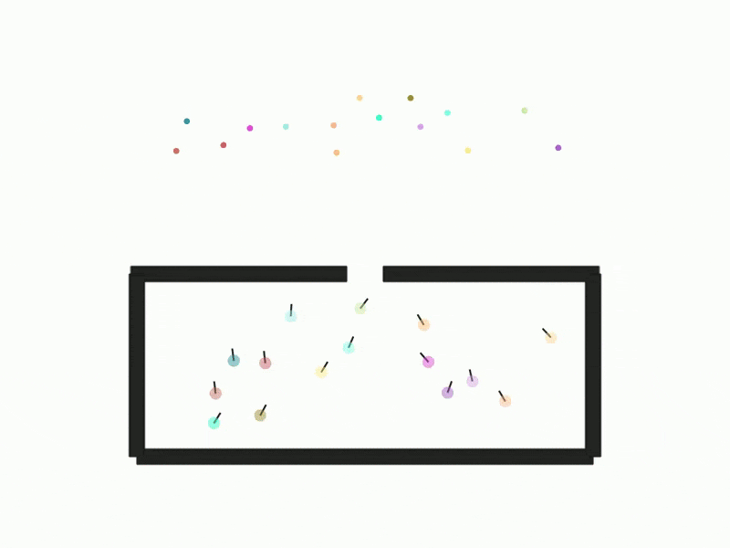
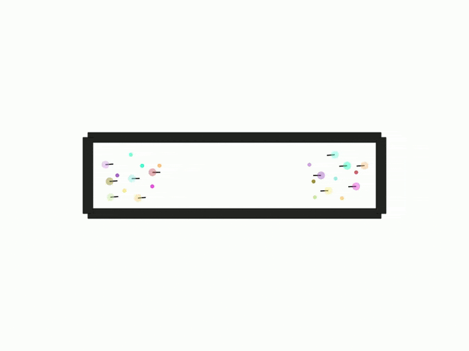
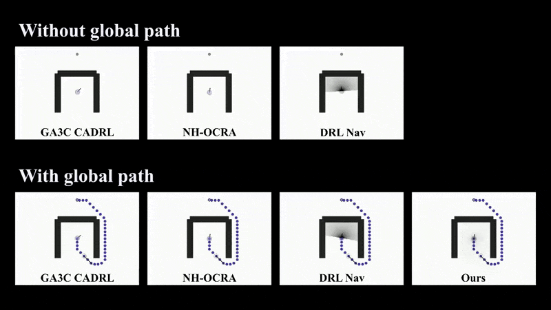
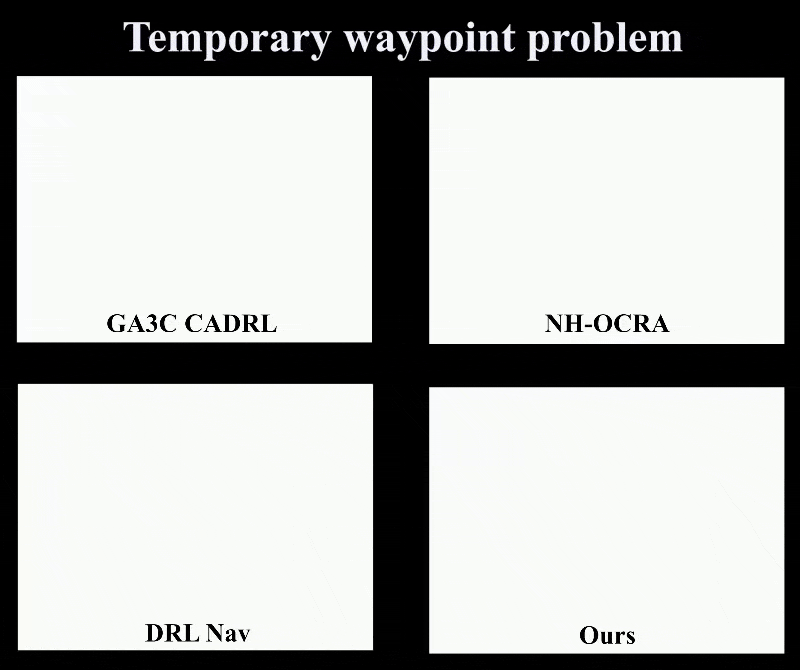
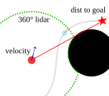
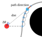
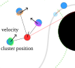
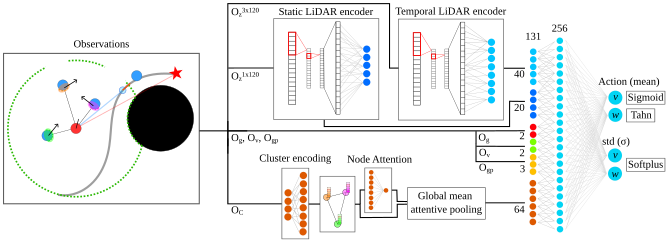

# GIANT - Global Path Integration and Attentive Graph Networks for Multi-Agent Trajectory Planning
|  |  |
|:---------------------------------------------------------:|:---------------------------------------------------------:|
|  |  |

This repository contains the official implementation of the paper **"GIANT - Global Path Integration and Attentive Graph Networks for Multi-Agent Trajectory Planning"**. This work introduces a novel approach to multi-robot collision avoidance, integrating global path planning with local navigation strategies.

The main contributions of this work include:
- We introduce a local navigation model that incorporates global path information within the observation space, enabling the agent to maintain adherence to pre-planned routes while reacting to dynamic changes in the environment.
- The model employs graph structures to represent and manage interactions with neighboring agents using attentive graph neural networks, improving the robots’ ability to navigate dense environments.
- The ability to navigate in complex, dynamic environments with noisy sensor data.
- Superior performance when compared to other baselines like NH-OCRA, DLR-NAV, and GA3C-CADRL in multiple simulated environments.

## Table of Contents
- [Problem Statement](#problem-statement)
- [Our Solution](#our-solution)
- [Installation](#installation)
- [Usage](#usage)
- [Baselines](#baselines)
- [Project Structure](#project-structure)
- [Links](#links)
- [Contributing](#contributing)
- [License](#license)

## Problem Statement
Multi-robot systems face significant challenges when navigating complex environments without effective global planning. Global planners are essential in predicting efficient paths and guiding robots toward their goals. However, without a global planner, robots can become stuck in local minima, unable to navigate through dense or dynamic environments effectively.

While many navigation methods are trained with a single goal point, they depend on running waypoints from a global planner to prevent them from becoming trapped in these local minima. The lack of coordination between global objectives and local navigation often results in inefficiencies, as robots focus too narrowly on immediate targets, missing the broader context of the overall path.
|||
|-------------------|-------------------|

## Our Solution
Our approach addresses these challenges by integrating global path planning with local navigation in a more balanced and efficient way. First, we separate the goal point from the global path in the observation space, allowing the network to learn when to prioritize the global path versus immediate local goals. This distinction helps the robot balance its focus, avoiding over-fixation on temporary waypoints and reducing the risk of getting stuck in new local minima.

Additionally, our model uses both raw sensor data for understanding the complexities of the environment and processed data for tracking dynamic objects like neighboring agents. By incorporating attentive graph neural networks, our model efficiently handles interactions with multiple agents. The attention mechanism allows the network to dynamically focus on the most relevant agents in the environment, ensuring that the robot can navigate safely and efficiently even in dense, dynamic scenarios.
||||
|--------------------|--------------------|--------------------|
|<p align=center>Raw lidar and goal observations</p>|<p align=center>Global path observation</p>|<p align=center>Neighborhood observation</p>|

Our approach integrates multiple observation modalities, allowing the network to make informed decisions in dynamic environments. As shown above, the raw LiDAR and goal observations capture the robot's immediate surroundings, while the global path observation ensures adherence to the pre-planned trajectory. The neighborhood observation leverages attentive graph neural networks to track nearby agents, dynamically focusing on the most relevant interactions for collision avoidance.

These observation spaces feed into a comprehensive network architecture that balances local navigation with global objectives, enabling the robot to navigate complex environments efficiently and safely.

||
|--------------------|
|<p align=center>Network architecture</p>|

## Installation

1. Clone with submodules:
   ```bash
   git clone --recurse-submodules https://github.com/Zartris/GIANT_MultiAgentRLCollisionAvoidance.git
   cd GIANT_MultiAgentRLCollisionAvoidance
   ```

2. Create a virtual environment and install the pinned dependencies:
   ```bash
   python3 -m venv .venv && source .venv/bin/activate
   pip install -r requirements.txt
   ```

3. Install the native libraries required by VMAS and the RVO2 baseline:
   ```bash
   sudo apt-get update
   sudo apt-get install -y build-essential libgl1 libglu1-mesa libglib2.0-0 xvfb
   ```

   `xvfb` provides the virtual display, but it does not provide GLU. The `libglu1-mesa` package is required because VMAS imports pyglet's OpenGL renderer at startup.

4. Headless machines: the simulator (VMAS) opens an X display at import time. Prefix training/evaluation commands with `xvfb-run -a`, or start a persistent virtual display:
   ```bash
   Xvfb :99 -screen 0 1280x1024x24 & export DISPLAY=:99
   ```

5. Alternatively use the Docker environment — see [`docker/README.md`](docker/README.md). The Dockerfile installs the native OpenGL and Xvfb packages automatically.

Verify the install without a GPU or display:
```bash
python3 -m pytest tests/test_config.py tests/test_config_examples.py tests/test_action_scaler.py -q
```

## Usage

Start standard from-scratch training with the full-fidelity baseline config:
```bash
xvfb-run -a python3 -m train.LidarSingleStep --config configs/baseline.yaml
```
Training logs to the Weights & Biases project `giant` when `WANDB_API_KEY` is set in the environment, and falls back to file logging otherwise.

For a quick installation and configuration check, run the small smoke test:
```bash
xvfb-run -a python3 -m train.LidarSingleStep --config configs/smoke.yaml
```

For adaptive multi-stage training, use the curriculum config:
```bash
xvfb-run -a python3 -m train.LidarSingleStep --config configs/curriculum.yaml
```

The attention-enabled model uses `gnn_attention: emb` by default. The
`configs/finetune_attention.yaml` config is for fine-tuning an existing
checkpoint, not for starting a new training run.

Evaluate the trained model across the paper scenarios and agent-count sweeps defined in
`configs/eval.yaml`:
```bash
xvfb-run -a python3 -m evaluate.eval_LidarSingleStep \
   --config configs/eval.yaml \
   --checkpoint models/checkpoints/ours/OurGraphModel.pth \
   --no-video \
   --output-dir results/eval
```

For some of the higher agent environments might be crashing out, use fewer parallel environments by overwriting and targeting a specific scenario:
```bash
xvfb-run -a python3 -m evaluate.eval_LidarSingleStep \
   --config configs/eval.yaml \
   --checkpoint models/checkpoints/ours/OurGraphModel.pth \
   --scenario random \
   --num-agents 40 \
   --num-eval-envs 4 \
   --no-video \
   --output-dir results/eval_random_40
```

Print a comparison table of selected results, or regenerate the paper videos:
```bash
python3 -m evaluate.compare_models
xvfb-run -a python3 -m evaluate.paper_videos --config configs/paper_videos.yaml
```

## Baselines

- **Python-RVO2 (NH-ORCA)** — included as a git submodule under `models/baseline/Python-RVO2`; build it by following the README inside the submodule.
- **DRL-Nav** — pretrained checkpoint included under `models/checkpoints/NAV_DRL/`.
- **GA3C-CADRL** — relies on TensorFlow 1.5.0, which requires Python 3.6. To run this baseline, set up a separate Python 3.6 environment with TensorFlow 1.5.0 (checkpoints under `models/checkpoints/GA3C_CADRL/`; served to the simulator via `models/baseline/GA3C_CADRL/zmq_server.py`). Everything else in the repository runs on modern Python and PyTorch.

## Project Structure
```
├── configs/                   # Declarative YAML configs for training, evaluation, and videos
├── docker/                    # Compose-based dev environment (CUDA/torch/vmas stack)
├── evaluate/                  # Evaluation scripts
│   ├── compare_models.py      # Print table of selected results from the results folder
│   ├── eval_LidarSingleStep.py# Run config-driven evaluation
│   └── paper_videos.py        # Regenerate the paper videos
├── models/                    # Models and policies for training and evaluation
│   ├── baseline/              # Baseline models (GA3C_CADRL, RVO2, DRL-Nav)
│   ├── checkpoints/           # Pretrained checkpoints (git LFS)
│   ├── distributions.py       # Distributions utility for models
│   ├── model_loader.py        # Utility to load models
│   └── MultiAgentLidarModel.py# Our neural networks
├── scenario/                  # Scenarios for simulation and evaluation
│   ├── GlobalPlanner/         # Global path planning used in the scenarios
│   ├── PaperScenarioes/       # Scenarios used for showcasing the problem (not in the evaluation)
│   └── CollisionAvoidance_*.py# All scenarios used in the paper (one file per scenario)
├── scripts/                   # Native install script
├── tests/                     # Regression test suite (shape contracts and invariants)
├── train/                     # Training entry point and utilities
│   ├── utils/                 # Logging, loss functions, curriculum, schedulers
│   └── LidarSingleStep.py     # Main training script
└── requirements.txt           # Pinned Python dependencies
```

## Links

- **Paper**: [Download the paper here](https://arxiv.org/pdf/2603.04659) [or here](https://ieeexplore.ieee.org/document/11246312)
- **Video**: [Watch the presentation video here](https://www.youtube.com/watch?v=42iTlEm0_Bk)

If you use this repository or build upon this work, please cite the following paper:
```
@inproceedings{lefevre2025giant,
  author    = {le Fevre Sejersen, Jonas and Suzumura, Toyotaro and Kayacan, Erdal},
  booktitle = {2025 IEEE/RSJ International Conference on Intelligent Robots and Systems (IROS)},
  title     = {GIANT - Global Path Integration and Attentive Graph Networks for Multi-Agent Trajectory Planning},
  year      = {2025},
  pages     = {10556--10563},
  keywords  = {Training, Adaptation models, Navigation, Trajectory planning,
               Noise, Robustness, Graph neural networks, Collision avoidance,
               Intelligent robots, Logistics},
  doi       = {10.1109/IROS60139.2025.11246312}
}
```

## Contributing

Contributions are welcome! Please submit a pull request with any improvements or bug fixes. For major changes, please open an issue first to discuss what you would like to change.

## License

This project is licensed under the MIT License. See the [LICENSE](./LICENSE) file for more details.
